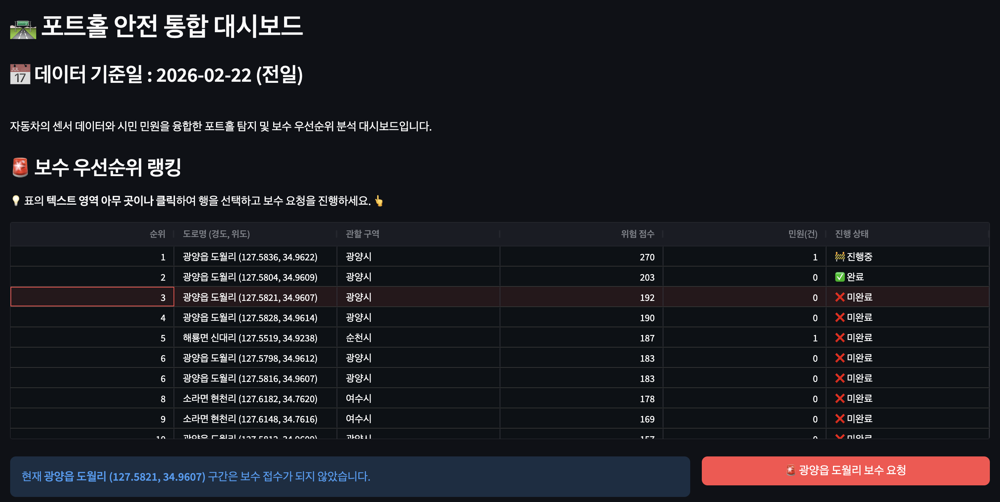
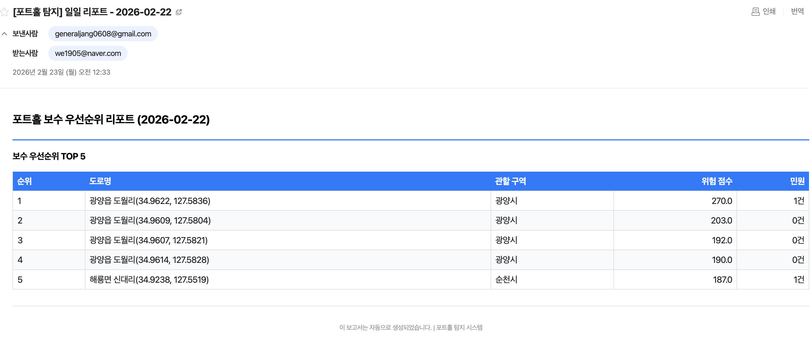

# DE-Team3-LOV3

# 🚗 포트홀 조기 탐지 시스템 (Pothole Early Detection System)

> **차량 센서 데이터와 분산 처리를 활용한 저비용·고효율 도로 관리 솔루션**
> 
> 
> 여수국가산업단지 인근 지방도 863호선을 모델로 하여, 민원 신고에 의존하던 기존 도로 관리 방식을 데이터 기반의 **선제적 보수 체계**로 전환합니다.
>

## 목차
1. [프로젝트 개요](#1-프로젝트-개요)
2. [솔루션](#2-솔루션)
3. [기대 효과](#3-기대-효과)
4. [데이터 프로덕트](#4-데이터-프로덕트)
5. [데이터 파이프라인 설계 및 기술적 고려](#5-데이터-파이프라인-설계-및-기술적-고려)
6. [기술 스택](#6-기술-스택)
7. [팀원 소개](#7-팀원-소개)

## 1. 프로젝트 개요

### 배경 및 문제점

**여수공단(여수국가산업단지) 주변 지방도 863호선**은 화물차 통행량이 많아 무거운 차량 하중으로 인한 도로 피로 파손 및 포트홀이 빈번하게 발생합니다.

> **포트홀(Pothole)**: 아스팔트 도로포장이 파손되어 노면 일부가 항아리(pot) 모양으로 움푹 패인 형태. 차량 파손과 교통사고를 유발하여 **’도로 위의 지뢰’** 라 불립니다.

### 863호선 현황

| 항목 | 내용 |
| --- | --- |
| **일간 교통량** | 약 5,000대 (화물차 비중 높음) |
| **위험 요소** | 위험 시설물 인접, 사고 시 2차 피해 가능성 |
| **유지관리 예산** | 전라남도 포장도 유지관리 사업비 83.19억 원 |

### 기존 방식의 한계

지방도는 **PMS(Pavement Management System)** 를 예산 문제로 사용하지 못해 포트홀 발견을 **민원 신고에 의존**하고 있습니다.

| 구분 | 비용 | 한계점 |
| --- | --- | --- |
| 정밀 장비 도입 | 5~9억 원 | 초기 투자 비용 과다 |
| 2~3년 주기 조사 | 약 6.8억 원 | 실시간 모니터링 불가 |
| 상시 운영 시 | 약 2,482억 원 (추정) | 재정적 부담 과다 |

### 전략적 목표

**24시간 조치 골든타임 확보**
- 차량 센서 데이터 수집 → 분석 → 서빙까지 **24시간 이내** 완료
- 주무관이 출근 직후 전날 리포트를 확인하고 즉시 보수 팀 디스패치

**한정된 자원의 효율적 배분**
- 충격 강도, 발생 빈도, 도로 등급을 결합한 **보수 우선순위 자동 산정**
- 가장 위험한 곳에 자원을 먼저 투입할 수 있는 객관적 지표 제공

## 2. 솔루션

**차량 센서 데이터**를 활용하여 포트홀을 탐지합니다.

| 단계 | 설명 |
| --- | --- |
| **이상 탐지 (Stage1)** | 차량 센서 데이터에서 Z축 가속도 기반 충격 이벤트를 판별 |
| **공간 클러스터링 (Stage2)** | 50m 단위 세그먼트(`s_id`)별로 그룹화하여 포트홀 구간 집계 |
| **우선순위 산정** | 충격 강도 + 발생 빈도 + 도로 등급을 결합한 스코어링 시스템 |

### 결과물

| | 설명 |
| --- | --- |
| **포트홀 관제 대시보드** | 긴급 보수가 필요한 구간을 최상단에 배치한 ‘Action List’ 제공 |
| **자동 이메일 리포트** | 매일 배치 완료 후 담당 주무관에게 보수 우선순위 리포트 자동 발송 |

 

**포트홀 관제 대시보드**

 

**자동 이메일 리포트**

## 3. 기대 효과

| 관점 | 효과 |
| --- | --- |
| **경제적** | PMS 대비 **90% 이상 비용 절감**, 소형 포트홀 선제 보수로 재포장 예산 절감 |
| **사회적** | 타이어 파손·연쇄 추돌 등 대형 사고 미연 방지, 차량 파손 배상 건수 감소 |
| **기술적** | Spark 기반 수평 확장 가능, 현장 보수 결과 환류를 통한 탐지 정확도 고도화 |

## 4. 데이터 프로덕트 

### 4-1. 데이터 흐름도

- **차량 센서 데이터** — 가속도, 자이로, GPS 등 주행 측정값 (S3 Parquet)
- **ITS 표준노드링크** — 863호선 도로 속성 (Shapefile)
- **외부 API** — Kakao 역지오코딩, 공공 민원 데이터

### 4-2. 데이터 아키텍처

### 4-3. 모듈 설명

각 모듈의 상세 내용은 개별 문서를 참고해 주세요.

| 모듈 | 역할 |
| --- | --- |
| [**ingestion_service**](./ingestion_service/README.md) | 863호선 가상 센서 데이터 생성 및 S3 적재 (Parquet) |
| [**road_network_builder**](./road_network_builder/README.md) | 863호선 도로망 50m 세그먼트 분할 + 도로 위험도 등급 산출 |
| [**processing_service**](./processing_service/README.md) | Spark 2단계 배치 처리 (이상탐지 → 공간 클러스터링) |
| [**serving_service**](./serving_service/README.md) | S3 → PostgreSQL 적재, MV 기반 대시보드, 우선순위 스코어링 |
| [**infra**](./infra/README.md) | Spark Standalone 클러스터 구성, EC2 온디맨드 기동/종료 |
| [**airflow_service**](./airflow_service/README.md) | 4개 TaskGroup으로 구성된 일간 배치 파이프라인 DAG |

## 5. 데이터 파이프라인 설계 및 기술적 고려

### 5-1. 기술적 고려사항 
- [spark 최적화](./docs/spark.md)
- [데이터 모델링](./docs/data_modeling.md)

### 5-2. 비즈니스 로직 고려 사항
- [방지턱 필터링](./docs/bump_filtering.md)
- [민원 데이터, 위험 도로 등급으로 가중치 설정](./docs/real_data.md)

### 5-3. 운영 고려 사항
- [S3 인터페이스를 통한 모듈 간 의존성 분리](./docs/s3_interface.md)
- [Airflow 장애 알림 설계](./docs/alerting.md)
- [GitHub Actions CD — Spark 코드 자동 배포](./docs/cd_pipeline.md)
- [인프라 관리 — EC2 클러스터 온디맨드 운영](./docs/infra_management.md)

##  6. 기술 스택

### Data Processing

### Visualization

### Infrastructure

### Orchestration / CI·CD

##  7. 팀원 소개

<table align="center">
  <tr>
    <td align="center"><a href="https://github.com/Youn-Rha"><b>라연</b></a></td>
    <td align="center"><a href="https://github.com/statjhw"><b>장현우</b></a></td>
    <td align="center"><a href="https://github.com/Jo-Hyeonu"><b>조현우</b></a></td>
  </tr>
  <tr>
    <td align="center"></td>
    <td align="center"></td>
    <td align="center"></td>
  </tr>
  <tr>
    <td align="center"><b>DE</b></td>
    <td align="center"><b>DE</b></td>
    <td align="center"><b>DE</b></td>
  </tr>
</table>

