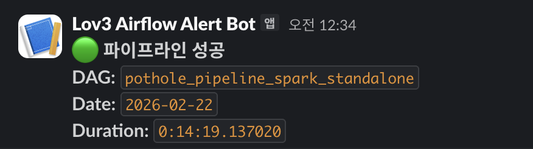

# Airflow 장애 알림 설계

## 문제

S3 인터페이스를 통해 각 서비스의 **데이터 의존성**은 분리했지만, **실행 의존성**은 별도의 문제입니다. Airflow는 오케스트레이터 역할상 각 서비스가 돌아가는 인프라(Spark 클러스터, Serving EC2)에 SSH로 접근하여 태스크를 실행해야 합니다. 데이터는 S3로 느슨하게 연결되어 있지만, 실행 자체는 Airflow가 모든 인프라에 직접 명령을 내리는 구조이므로 어느 한 곳의 인프라 장애가 파이프라인 실행을 멈출 수 있습니다.

```
Airflow EC2
  ├── SSH → Spark Master  (Stage1, Stage2 실행)
  ├── SSH → Spark Workers  (의존성 설치)
  ├── SSH → Serving EC2    (DB 적재, MV 갱신, 리포트)
  └── AWS CLI → EC2 API    (클러스터 시작/종료)
```

문제를 빠르게 인지하지 못하면 EC2 인스턴스가 켜진 채로 방치되어 비용이 낭비되거나, 대시보드에 오래된 데이터가 계속 노출됩니다.

## 설계: 태스크 단위 Slack 알림

### 실패 알림 (on_failure_callback)

모든 태스크에 `on_failure_callback`을 설정하여, **어떤 태스크가 실패하든 즉시 Slack으로 알림**이 갑니다.

```python
def slack_failure_callback(context):
    ti = context.get("task_instance")
    exception = context.get("exception", "")
    _send_slack(
        f":red_circle: *Airflow Task 실패*\n"
        f"*Task:* `{ti.task_id}`\n"
        f"*Date:* `{context.get('execution_date')}`\n"
        f"*Error:* `{str(exception)[:300]}`"
    )
```

알림 메시지에 태스크 이름과 에러 내용이 포함되어, **어느 모듈에서 문제가 발생했는지 바로 파악** 가능합니다.

| 실패 태스크 | 원인 추정 |
|-------------|----------|
| `infra_setup.start_cluster` | EC2 시작 실패 (AWS API 문제, 인스턴스 ID 오류) |
| `infra_setup.start_spark` | Spark Master SSH 접속 실패, 클러스터 기동 실패 |
| `spark_processing.run_stage1` | Spark 잡 실패 (데이터 문제, 메모리 부족) |
| `spark_processing.check_s3_stage1_out` | Stage1 출력 없음 (Spark 잡이 빈 결과 생성) |
| `serving.load_to_rdb` | Serving EC2 SSH 실패, PostgreSQL 다운 |
| `serving.refresh_views` | MV 갱신 실패 (Docker 컨테이너 중지 등) |

### 성공 알림 (on_success_callback)

DAG 전체가 성공하면 소요 시간과 함께 알림을 보냅니다. 매일 알림이 오는지 확인하는 것만으로도 파이프라인이 정상 동작하는지 모니터링할 수 있습니다.

```python
def slack_success_callback(context):
    dag_run = context.get("dag_run")
    _send_slack(
        f":large_green_circle: *파이프라인 성공*\n"
        f"*Date:* `{dag_run.execution_date.strftime('%Y-%m-%d')}`\n"
        f"*Duration:* `{dag_run.end_date - dag_run.start_date}`"
    )
```

### 실패해도 클러스터는 반드시 종료

장애 알림과 별개로, **비용 안전장치**로 `infra_cleanup` TaskGroup의 `stop_spark`과 `stop_cluster`는 `trigger_rule=all_done`으로 설정했습니다. 파이프라인 중간에 어떤 태스크가 실패하더라도 EC2 인스턴스는 반드시 종료됩니다.

```
[any task fails]
    ↓ (trigger_rule=all_done)
stop_spark → stop_cluster
```

## 알림 채널


Slack Incoming Webhook을 사용하며, 환경변수 `SLACK_WEBHOOK_URL`로 설정합니다. 설정하지 않으면 알림을 건너뛰고 파이프라인은 정상 동작합니다.

