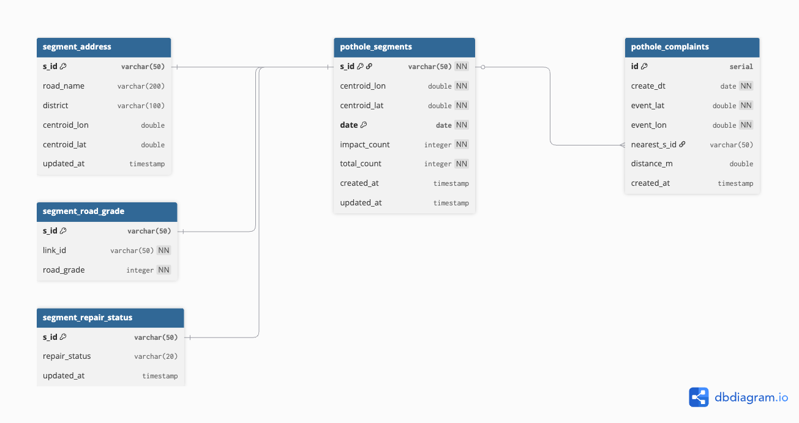

# 데이터 모델링 — 기술적 고려 사항

## 개요

Serving Layer의 PostgreSQL 데이터 마트는 **일간 배치 파이프라인의 결과를 적재**하고 **대시보드에 최적화된 형태로 제공**하는 두 가지 역할을 합니다. 이 문서는 테이블 설계, 적재 전략, 뷰 설계에서 어떤 기술적 판단을 했고 그 이유가 무엇인지를 정리합니다.

---

## 1. Fact / Dimension 분리

### 테이블 구조

```
pothole_segments (Fact)          ← 매일 적재, 측정값 중심
  PK: (s_id, date)
  measures: impact_count, total_count

segment_address (Dimension)      ← 세그먼트 속성, 변경 드묾
  PK: s_id
  attributes: road_name, district

segment_road_grade (Dimension)   ← 정적 참조 데이터
  PK: s_id
  attributes: road_grade (1~5)

pothole_complaints (Fact)        ← 외부 민원 데이터
  PK: id
  UK: (create_dt, event_lat, event_lon)

segment_repair_status (Dimension) ← 피드백 루프용
  PK: s_id
  attributes: repair_status
```

### 분리 이유

Fact 테이블(`pothole_segments`)에 도로명, 행정구역, 도로 등급 같은 속성을 함께 저장하면 **매일 3,535행마다 동일한 문자열이 반복 저장**됩니다. 이를 Dimension 테이블로 분리하면:

- **저장 효율**: Fact에는 숫자형 측정값만 저장 (행당 ~50바이트)
- **갱신 독립성**: 도로명이 변경되어도 Dimension만 UPDATE하면 되고, 과거 Fact 데이터는 건드릴 필요 없음
- **조인 비용 vs 저장 비용 트레이드오프**: 대시보드 쿼리에서 JOIN이 필요하지만, MV로 사전 집계하므로 실시간 JOIN 비용은 발생하지 않음

### Dimension 갱신 방식

`segment_address`는 변경이 발생하면 기존 행을 덮어씁니다. 도로명이나 행정구역은 변경 빈도가 매우 낮고, 과거 이력보다 현재 값이 중요하기 때문입니다. `updated_at` 타임스탬프로 마지막 갱신 시점만 추적합니다.

---

## 2. 멱등성 보장 (UPSERT)

### 문제

Airflow DAG이 실패 후 재실행(`--force`)되거나, 같은 날짜의 데이터를 다시 처리하면 중복 적재가 발생할 수 있습니다.

### 해결: ON CONFLICT DO UPDATE

```sql
INSERT INTO pothole_segments (s_id, centroid_lon, centroid_lat, date, impact_count, total_count)
VALUES (:s_id, :centroid_lon, :centroid_lat, :date, :impact_count, :total_count)
ON CONFLICT (s_id, date) DO UPDATE SET
    impact_count = EXCLUDED.impact_count,
    total_count  = EXCLUDED.total_count,
    updated_at   = CURRENT_TIMESTAMP
```

- `(s_id, date)`가 PK이자 충돌 감지 기준
- 같은 세그먼트+날짜 조합이 이미 존재하면 측정값을 최신 값으로 갱신
- 몇 번을 재실행해도 결과가 동일 → **멱등성 보장**

민원 테이블도 `UNIQUE (create_dt, event_lat, event_lon)`으로 동일한 민원의 중복 적재를 방지합니다.

---

## 3. Materialized View 설계

### 왜 MV인가

대시보드가 직접 Fact + Dimension JOIN 쿼리를 실행하면:
- `pothole_segments` 스캔 + `segment_address` JOIN + `pothole_complaints` 서브쿼리 + `segment_road_grade` JOIN
- 사용자 요청마다 이 비용이 반복 발생

**Materialized View로 사전 집계**하면 대시보드는 단순 SELECT만 수행하고, 갱신은 배치 적재 직후 한 번만 발생합니다.

### 3개 MV의 역할과 설계

#### mvw_dashboard_heatmap — 위험도 히트맵

```sql
risk_rate = (impact_count / total_count) * 100
WHERE date = (SELECT MAX(date) FROM pothole_segments)
```

- **최신 날짜 1일치만** 포함하여 MV 크기를 최소화 (~3,535행)
- Fact + segment_address를 JOIN하여 도로명/행정구역을 비정규화

#### mvw_dashboard_weekly_stats — 주간 트렌드

```sql
WHERE date >= MAX(date) - INTERVAL '6 days'
```

- 최신 날짜 기준 **7일 슬라이딩 윈도우**
- `EXTRACT(ISODOW)` + `TO_CHAR`로 요일 정보를 사전 계산하여 프론트엔드 로직 제거

#### mvw_dashboard_repair_priority — 보수 우선순위

```sql
priority_score = (total_impacts * 1.0) + (complaint_count * 50.0) + (road_grade * 10.0)
```

- **3개 데이터 소스를 하나의 스코어로 통합**: 센서 탐지(Fact) + 시민 민원(Fact) + 도로 등급(Dimension)
- CTE로 각 소스를 사전 집계한 뒤 LEFT JOIN → 한쪽 데이터가 없어도 누락 없이 계산
- `COALESCE`로 NULL 안전 처리 (민원 없는 세그먼트 = 0건, 등급 없는 세그먼트 = 3등급)
- `RANK() OVER` 윈도우 함수로 순위 사전 계산

### MV 갱신 전략

```sql
REFRESH MATERIALIZED VIEW CONCURRENTLY mvw_dashboard_heatmap;
```

- **CONCURRENTLY**: 갱신 중에도 기존 데이터로 읽기 가능 (대시보드 무중단)
- CONCURRENTLY 사용을 위해 각 MV에 **UNIQUE INDEX** 필수 생성
- 갱신 시점: Airflow DAG의 `refresh_views` 태스크 (데이터 적재 직후)

---

## 4. 외부 API 호출 최소화

### Kakao 역지오코딩 — 신규 세그먼트만 호출

```sql
SELECT DISTINCT p.s_id, p.centroid_lon, p.centroid_lat
FROM pothole_segments p
LEFT JOIN segment_address sa ON p.s_id = sa.s_id
WHERE sa.s_id IS NULL  -- segment_address에 없는 것만
```

- 863호선의 세그먼트는 3,535개로 고정. 최초 적재 시 한 번만 역지오코딩하면 이후에는 호출 없음
- LEFT JOIN + IS NULL 패턴으로 **이미 등록된 세그먼트는 건너뜀**
- Kakao API 일일 호출 제한(30만 건)에 안전

### 공공 민원 API — 중복 방지 + 공간 필터

- `UNIQUE (create_dt, event_lat, event_lon)`으로 같은 민원의 중복 INSERT 방지
- cKDTree로 863호선 세그먼트와 매칭 후, **500m 이내**인 것만 적재 → 불필요한 데이터 차단

---

## 5. 데이터 품질 체크

적재 후 자동으로 3가지 품질 검증을 수행합니다.

| 체크 항목 | 조건 | 대응 |
|-----------|------|------|
| 비정상 비율 | `impact_count > total_count` | WARNING 로그 |
| 누락 세그먼트 | `s_id IS NULL OR s_id = ''` | WARNING 로그 |
| 데이터량 급변 | 전일 대비 ±50% 이상 변동 | WARNING 로그 |

파이프라인을 중단시키지 않되, 이상 징후를 기록하여 Slack 알림과 함께 모니터링할 수 있도록 했습니다.

---

## 6. ER 다이어그램


